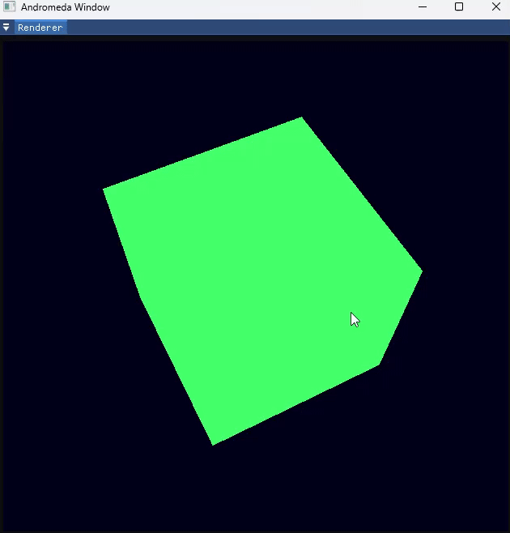

# Andromeda
An engine made to display solar system.



### 1. Set Up
1. Download [3rdParty](https://drive.google.com/uc?export=download&id=12FWyoT9oNLicftqyYy6T3bgmBVZnht8h) and place the extracted catalog next to andromeda src code like this:
    ```
        path/to/catalog/
            ├── andromeda
            ├── 3rdParty
    ```
2. Build andromeda project

### 2. Running on VS Code (Linux)
1. **Install Dependencies:**  
    Ensure that you have [CMake](https://cmake.org/) installed. You can install it via your package manager:
    ```bash
    sudo apt install cmake
    ```
2. **Install VS Code Extensions:**  
    Install the __CMake__ and __CMake Tools__ extension in Visual Studio Code. 
3. **Open the Project:**  
    Open the project folder in VS Code.
4. **Configure Build Mode:**  
    Using the CMake Tools extension, configure the project by selecting either Debug or Release mode. You can do this through the status bar or the command palette (Ctrl+Shift+P → "CMake: Configure").
5. **Build and Run:**  
    Press the Build button provided by the extension (or run "CMake: Build" from the command palette). After a successful build, run the application by pressing the Run button or hitting F5.

### 3. Future goals
1. Develop a 3D engine utilizing OpenGL that can render the [solar system application](https://github.com/ArturasDruteika/SolarSystem).
2. Implement ray tracing.
3. (In the far far future) develop the same engine using Vulkan.

### 4. Notes
At the moment I do not intend it to be an engine dedicated to creating games or anything like that. It is just a simple learning project.
