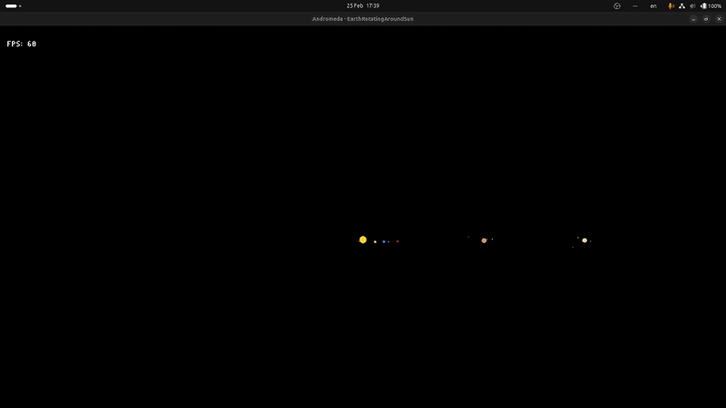

# Andromeda
A graphics engine made to display the solar system.




## Project Structure
```
Andromeda/
├── Assets/           # Images, shaders, and other assets
├── CPP/              # Main C++ source code and modules
│   └── Examples/     # Example projects and code samples
├── Scripts/          # Build and setup scripts
├── build/            # Build output directory
├── README.md         # Project documentation
├── LICENSE           # License information
└── ...
```

## Setup & Building
1. Clone the repository and initialize submodules:
    ```sh
    git clone --recursive https://github.com/ArturasDruteika/Andromeda.git
    # or, if already cloned:
    git submodule update --init --recursive
    ```
2. Install build dependencies (Linux example):
    ```sh
    ./Scripts/setup-linux.sh
    ```
3. Build the project:
    ```sh
    ./Scripts/build-linux.sh
    ```
4. Run the app (Example)
    ```sh
    cd build/Release/bin
    ./Example
    ```

## Running Examples
After building, you can run the example binaries from the build output directory. For example:
```sh
./build/Release/bin/Example
```
or (depending on your build type and configuration):
```sh
./build/linux-clang-release/Release/bin/Example
```
All code examples can be found inside the `CPP/Examples` directory.

## Running on VS Code (Linux)
1. **Install VS Code Extensions:**
    Install the __CMake__ and __CMake Tools__ extension in Visual Studio Code.
2. **Open the Project:**
    Open the project folder in VS Code.
3. **Configure Build Mode:**
    Using the CMake Tools extension, configure the project by selecting either Debug or Release mode. You can do this through the status bar or the command palette (Ctrl+Shift+P → "CMake: Configure").
4. **Build and Run:**
    You can use the VS Code build buttons, or simply run:
    ```sh
    ./Scripts/build-linux.sh
    ```
    After a successful build, run the application from the build output directory.

## Supported Platforms
- Linux (tested)
- Windows (experimental, may require additional setup)

## Contribution Guidelines
Please see the [CONTRIBUTING.md](CONTRIBUTING.md) file for guidelines on contributing, coding standards, and submitting pull requests.

## Troubleshooting & Common Issues
- Ensure all submodules are initialized: `git submodule update --init --recursive`
- Make sure all build dependencies are installed (see setup instructions above).
- If you encounter build errors, try cleaning the build directory and rebuilding.
- For further help, open an issue on GitHub.

## License
This project is licensed under the MIT License. See the [LICENSE](LICENSE) file for details.

## Contact & Community
For questions, suggestions, or to report issues, please use the GitHub Issues page or contact the maintainer via your preferred method.

## Future Goals
1. Develop a 3D engine utilizing OpenGL that can render the [solar system application](https://github.com/ArturasDruteika/SolarSystem).
2. Implement ray tracing (very very very huge maybe, but if I live long enough and if aliens aren't going to destroy Earth I will).
3. (In the far far future) develop the same engine using Vulkan.

## Notes

### Contribution Guidelines
Please see the [CONTRIBUTING.md](CONTRIBUTING.md) file for guidelines on contributing, coding standards, and submitting pull requests.

### Troubleshooting & Common Issues
- Ensure all submodules are initialized: `git submodule update --init --recursive`
- Make sure all build dependencies are installed (see setup instructions above).
- If you encounter build errors, try cleaning the build directory and rebuilding.
- For further help, open an issue on GitHub.

### License
This project is licensed under the MIT License. See the [LICENSE](LICENSE) file for details.

### Contact & Community
For questions, suggestions, or to report issues, please use the GitHub Issues page or contact the maintainer via your preferred method.
### Future goals
1. Develop a 3D engine utilizing OpenGL that can render the [solar system application](https://github.com/ArturasDruteika/SolarSystem).
2. Implement ray tracing (very very very huge maybe, but if I live long enough and if aliens aren't going to destroy Earth I will).
3. (In the far far future) develop the same engine using Vulkan.

